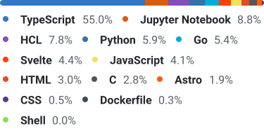
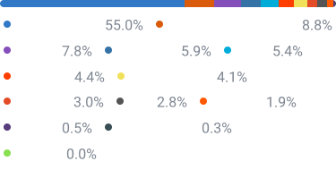

# 👾 Github Language Stats

## Overview

You can show your Github language stats like the `Languages` section in the repository.

## Samples

Light Theme | Dark Theme




## How to use

**URL**

https://reizt-gh-stats-api.vercel.app/api/langs

**Query Parameters**

<!-- table -->

| Name       | Type   | Description                           | Required | Default |
| ---------- | ------ | ------------------------------------- | -------- | ------- |
| `username` | string | Github username                       | Y        | -       |
| `theme`    | string | Theme of the chart. `light` or `dark` | N        | `light` |
| `limit`    | number | Limit of the languages                | N        | 10      |
| `output`   | string | Output format. `svg` or `html`        | N        | `svg`   |

**Headers**

You can include the stats of private repositories by using the `x-gh-token` header.
The token should have the metadata read permission.

## Set up your profile

> Note: Save your SVG files in the repository due to the limitation of Github API.

Replace `xxx` with your username.

1. Create a repository `xxx/xxx` if not exists.
2. Get the SVGs by the API.

```sh
curl --fail 'https://reizt-gh-stats-api.vercel.app/api/langs?username=xxx&theme=light' > ./langs.light.svg
curl --fail 'https://reizt-gh-stats-api.vercel.app/api/langs?username=xxx&theme=dark'  > ./langs.dark.svg
```

1. Show the SVGs in `README.md`.

> Note: You can use `gh-light-mode-only` and `gh-dark-mode-only` to show the SVGs in different themes

```md


```

### Daily Update

You can use cron job in Github Actions to update the SVGs daily.

If you want to include private repository stats, you need to set the repository secrets `GITHUB_TOKEN`.
If not, remove `-H` option in the `curl` command.

```yml
on:
  schedule:
    - cron: 0 0 * * * # every day
  push:
    branches:
      - main
jobs:
  update:
    runs-on: ubuntu-latest
    permissions:
      contents: write
    steps:
      - uses: actions/checkout@v4
      - name: Get SVGs
        run: |
          curl --fail -H "x-gh-token: ${{ github.token }}" 'https://reizt-gh-stats-api.vercel.app/api/langs?username=${{ github.actor }}&theme=light' > ./langs.light.svg
          curl --fail -H "x-gh-token: ${{ github.token }}" 'https://reizt-gh-stats-api.vercel.app/api/langs?username=${{ github.actor }}&theme=dark'  > ./langs.dark.svg
      - name: Commit
        run: |
          git remote set-url origin https://github-actions:${{ github.token }}@github.com/${{ github.repository }}
          git config --global user.name "${{ github.actor }}"
          git config --global user.email "${{ github.actor }}@users.noreply.github.com"
          if (git diff --shortstat | grep '[0-9]'); then
            git add .
            git commit -m "Update language stats"
            git push origin main
          fi
```
